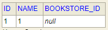
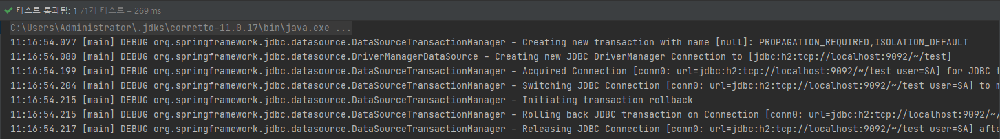
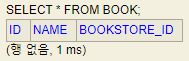

## 트랜잭션 구현 해설

### transaction aop 처리를 위한 proxy객체 구현

실제 @transactional 호출시 AOP proxy객체가 호출되어 트랜잭션 처리가 되는것을 감안해서 트랜잭션 proxy객체를 구현했고 , command pattern을 적용해 logic메서드 한개를 통해서 트랜잭션이 작동될수 있게 했다.

트랜잭션 프록시 객체의 구현 코드
```java

public void logic(){
        before();
        try {
            runLogic();
            after();
        }catch (Exception e){
            platformTransactionManager.rollback(status);
        }
    }

```

- before(autocommit = false 처리), after(transaction commit 및 connection release처리) 사이에 트랜잭션 처리를 하고싶은 비즈니스 로직 proxy메서드를 불러와서 실행시켰다.

### connection 동기화 문제

- proxy객체와 repository객체간의 connection이 다른 문제가 발생했는대 , transactionManager를 통해서 동기화 관리를 해주어 해결할수 있었다.
```java

platformTransactionManager = new DataSourceTransactionManager(TransactionManager.getDataSource());
status =platformTransactionManager.getTransaction(new DefaultTransactionAttribute());

```

### 비즈니스 로직 구현

- 비즈니스 로직을 담고있는 코드
```java

public class UseService extends TransactionalProxy{
    bookRepository bookRepository = new bookRepository();
    public UseService(String transactionMethodName) {
        super(transactionMethodName);
    }
    public void noError() throws SQLException {
        book book1 = new book();
        book book2 = new book();
        book1.setName("1");
        book1.setId(1);
        book2.setName("2");
        book2.setId(2);
        bookRepository.save(book1);
        bookRepository.save(book2);
    }
    public void getError() throws SQLException {
        book book1 = new book();
        book book2 = new book();
        book1.setName("1");
        book1.setId(1);
        book2.setName("2");
        book2.setId(1);
        bookRepository.save(book1);
        bookRepository.save(book2);
    }
}

```

## 트랜잭션 테스트 코드 해설

에러를 발생시키는 코드(id값이 동일해서 2번째 save호출시 에러가 발생한다)
```java

public void getError() throws SQLException {
        book book1 = new book();
        book book2 = new book();
        book1.setName("1");
        book1.setId(1);
        book2.setName("2");
        book2.setId(1);
        bookRepository.save(book1);
        bookRepository.save(book2);
    }

```


테스트 코드
```java

// Transaction처리를 못받게 비즈니스로직만을 실행시킨다.
    @Test
    public void noTransactionTest() throws RuntimeException ,SQLException{
        new UseService("getError").noLogic();
    }

```



transaction처리 없이 트랜잭션 중 에러가 발생시 한개의 작업은 이미 처리가 되어서 만약 결제 시스템의 경우라면 한쪽의 돈을 빼서 한쪽에 넣는 경우 중간에 에러발생시 모든 트랜잭션내용을 rollback해야 하지만 트랜잭션 처리가 되지않아서 롤백이 되지않고 한개만 저장된 모습이다.


트랜잭션을 적용한 테스트 코드
```java

// before, after를 다받아서 transaction처리를 받게한다.
    @Test
    public void transactionTest() throws SQLException{
        new UseService("getError").logic();
    }

```



트랜잭션이 적용된 코드의 경우 중간에 에러가 발생하니 롤백이 되는 모습이다.


